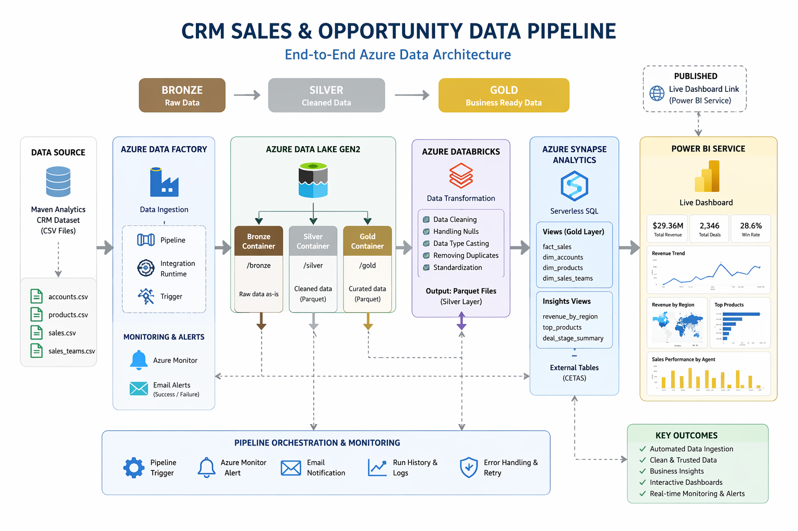
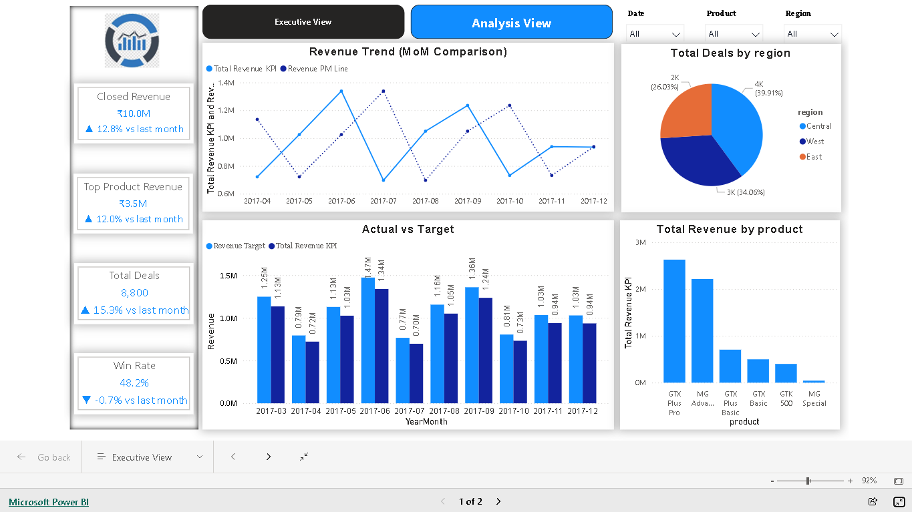
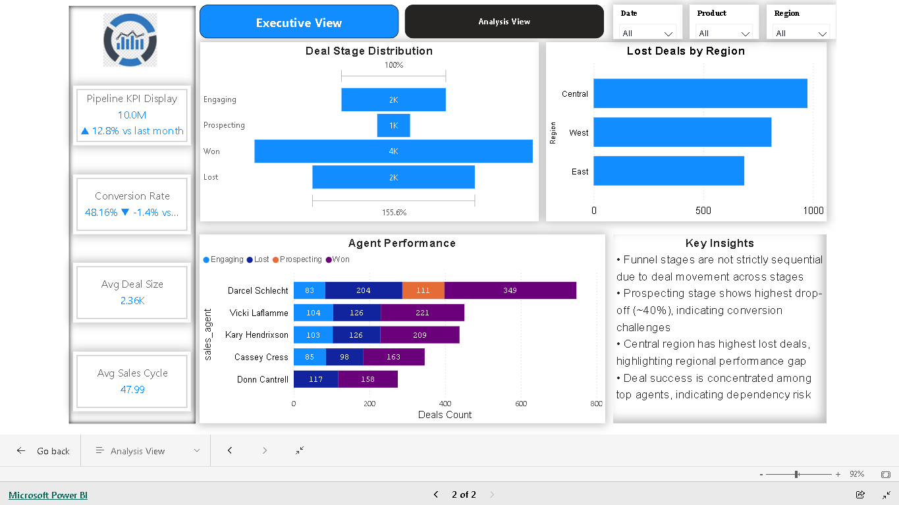

# 🚀 CRM Sales & Opportunity Analytics Pipeline (Azure End-to-End Project)

## 📌 Project Overview
---
This project demonstrates an end-to-end **data engineering and analytics pipeline** built on Azure.
The goal is to ingest CRM data, process it through layered architecture (Bronze → Silver → Gold), and generate actionable insights using Power BI.

---
## 📡 Live Dashboard

🔗 https://app.powerbi.com/view?r=eyJrIjoiYzQxZmI0NmEtMWRlNi00ZmM2LWI5OWQtMTJlNjdiMTMwYzZmIiwidCI6Ijc4NTAyYzI3LTY4ZTktNDA2Ni1iNmVkLWI3NjdjOWE2NDY2OSJ9

## 🏗️ Data Architecture
📌 *Architecture Diagram:*


The project follows a **Medallion Architecture**:

* **Bronze Layer** → Raw data ingestion
* **Silver Layer** → Data cleaning & transformation
* **Gold Layer** → Business-ready analytics

---
## 🧰 Tools & Technologies Used

* Azure Data Factory
* Azure Data Lake Gen2
* Azure Logic Apps
* Azure Monitor
* Azure Databricks
* Azure Key Vault
* Azure Synapse Analytics
* Power BI
* GitHub
* Microsoft Integration Runtime

---
## 🔄 End-to-End Pipeline Flow

### 1️⃣ Data Ingestion (Azure Data Factory)

* Built pipelines to ingest multiple CRM datasets:

  * Accounts
  * Products
  * Sales Pipeline
  * Sales Teams
  * Data Dictionary
* Data is loaded into **Azure Data Lake (Bronze layer)**
* Implemented:

  * Pipeline triggers
  * Monitoring using Azure Monitor
  * Alerts for success/failure
  * Email notifications

---

### 2️⃣ Monitoring & Alerting

* Integrated **Azure Monitor + Logic Apps**
* Configured:

  * Alerts on pipeline failure/success
  * Email notifications
* Ensured reliability and obervability of pipeline execution

---

### 3️⃣ Secure Access (Key Vault + IR)

* Used **Azure Key Vault** to securely manage credentials
* Configured **Microsoft Integration Runtime** for connectivity

---

### 4️⃣ Data Transformation (Azure Databricks - Silver Layer)

* Processed raw data from Bronze layer
* Performed:

  * Data cleaning
  * Null handling
  * Column standardization
  * Data type corrections
* Stored cleaned data in **Silver layer**

---

### 5️⃣ Data Modeling & Analytics (Azure Synapse - Gold Layer)

* Created:

  * External tables
  * Views for analytics

#### Key Gold Layer Views:

* Revenue by Region
* Deal Stage Summary
* Top Products
* Fact & Dimension tables

---
## 📊 Power BI Dashboard (Advanced Analytics Layer)

### 🔹 Dashboard Structure
### 📌 Page 1: Sales Performance Overview


**Focus:** What is happening  

**KPIs:**
- Total Revenue (with MoM growth)  
- Top Product Revenue  
- Win Rate %  
- Total Deals  

**Visuals:**
- Revenue Trend (MoM comparison)  
- Actual vs Target analysis
- Total Revenue by Product
- Interactive slicers (Date, Region, Product)  

**Advanced Features:**
- Tooltip → Product-level revenue breakdown  
- KPI indicators with ▲ / ▼ growth vs last month  
- Custom UI using PowerPoint background  

---

### 📌 Page 2: Sales Pipeline Insights


**Focus:** Why it is happening  

**KPIs:**
- Pipeline Value (MoM growth using DAX)  
- Conversion Rate (MoM comparison)  
- Avg Deal Size  
- Avg Sales Cycle  

**Visuals:**
- Pipeline Funnel (custom sorted using dimension table)  
- Lost Deals by Region  
- Agent Performance (stage-wise distribution)
- Key Insights 

---

## 🔥 Advanced Power BI Implementations

### 🔹 DAX Calculations
- Previous Month calculations using `DATEADD`  
- Growth % measures  
- KPI formatting using:
  - `UNICHAR(10)` for multi-line display  
  - Dynamic arrows (▲ ▼)
---

### 🔹 Data Modeling Enhancements
- Created **Date Table**  
- Built **Deal Stage Dimension Table** for correct funnel order  
- Implemented relationships for proper filtering  

---

### 🔹 UI/UX Enhancements
- Custom dashboard design using PowerPoint  
- Clean grid-based layout  
- Header-level slicers  
- Tooltip-based deep dive analysis  

---

### 🔹 Insight Layer (Key Differentiator 🚀)
Added business-driven insights directly in dashboard:

- Funnel stages are not strictly sequential due to deal movement  
- Prospecting stage shows highest drop-off (~40%)  
- Central region has highest lost deals  
- Revenue driven by top products (via tooltip)  
- Sales performance concentrated among top agents  

---

## 📊 Key Insights

📈 Revenue shows fluctuating trend with mid-year peaks  
- 📊 Deal volume increased (~15%), indicating strong pipeline  
- ⚠️ Win rate decline suggests conversion inefficiency  
- 🔻 Prospecting stage is main drop-off point  
- 🌍 Central region underperforms in deal closure  
- 👤 Top agents drive majority of performance (dependency risk)  

---


## 📁 Repository Structure

```bash
CRM-Sales-Pipeline-Azure/
│
├── data/                  # Raw datasets (CSV)
├── dataFactory/           # ADF pipelines, datasets, linked services
│   ├── dataset/
│   ├── factory/
│   ├── integrationRuntime/
│   ├── linkedService/
│   ├── pipeline/
│   ├── trigger/
│   └── publish_config.json
│
├── databricks/           # Transformation notebooks (Silver layer)
│   ├── Silver ( Data Cleaning).ipynb
├── sql/                   # Synapse SQL scripts (Gold layer)
│   ├── GOLD (SQL Insights).sql
│   ├── Gold_External_tables.sql
├── powerBi/               # Power BI dashboard (.pbix)
│   ├── CRM-Sales Report.pbix
├── Images/
│   ├── # Power BI Dashboards
│   ├── # Architecture diagram
└── README.md

```

---

## ⚡ Key Highlights

* End-to-end Azure pipeline implementation
* Real-world Medallion Architecture
* Automated Monitoring + Alerting integration
* Secure credential management using Key Vault
* Business-ready analytics using Power BI

---

## 📌 Conclusion

This project showcases how to build a scalable and production-like data pipeline using Azure services, transforming raw CRM data into meaningful business insights.

---

# 👤 Author

Bhavana
